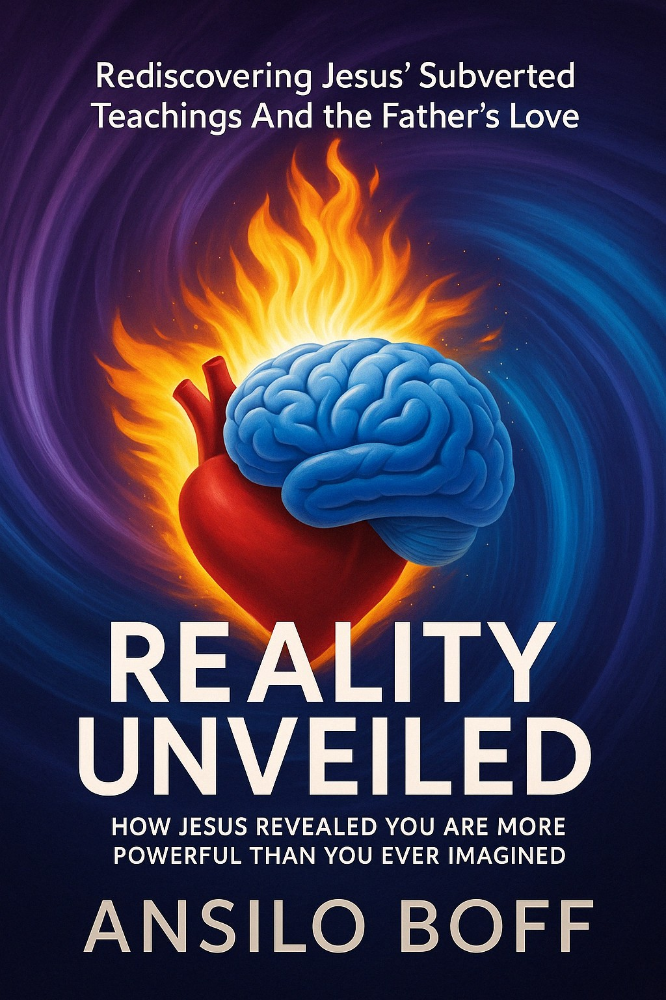
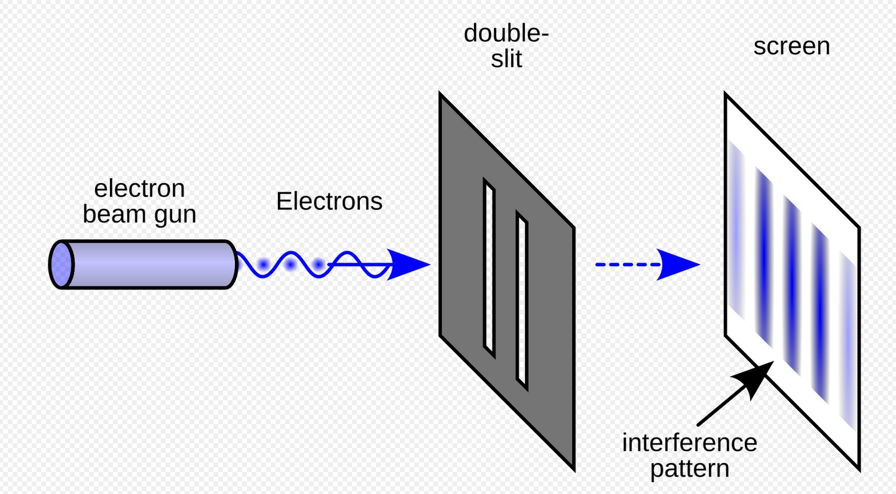
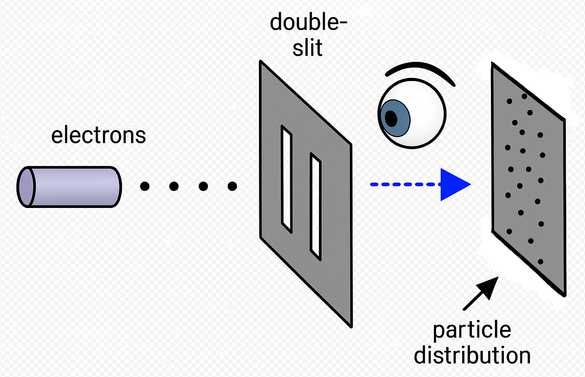

# Reality Unveiled

## How Jesus Revealed You Are More Powerful Than You Ever Imagined

### by Ansilo Boff

---

## Copyright

© 2025 Ansilo Boff

All rights reserved. No part of this publication may be reproduced, distributed, or transmitted in any form or by any means, including photocopying, recording, or other electronic or mechanical methods, without the prior written permission of the author, except in the case of brief quotations embodied in critical reviews and certain other noncommercial uses permitted by copyright law.

---

## Table of Contents

### Introduction
1. Introduction ........................................................................ 1

### Part 1: The Nature of Reality and Consciousness
2. Chapter 1: The Collapse of Materialism ............................... 15
3. Chapter 2: Quantum Reality - When Physics Meets Consciousness ... 35
4. Chapter 3: The Observer Effect - You Create Your Reality ......... 55

### Part 2: Evidence for Non-Local Consciousness
5. Chapter 4: What Near-Death Experiences Reveal .................... 75
6. Chapter 5: Reincarnation - The Evidence We Can't Ignore ......... 95
7. Chapter 6: Memory Beyond Brain Function ......................... 115

### Part 3: The Power of Consciousness
8. Chapter 7: You Are More Than You Think You Are ................. 135
9. Chapter 8: Connecting With the Father — Tapping the Stream of Higher Consciousness ..................................................... 155
10. Chapter 9: Living From Your Divine Core ......................... 175

### Conclusion
11. Conclusion: Jesus' Hidden Teachings .............................. 195

### Reference Materials
12. Appendix: Glossary of Key Terms .................................. 205
13. Bibliography ......................................................... 225

---

## Introduction: Beyond Religion to Reality

Congratulations on taking the next step. If you've read *"Liberating Humanity: How Jesus Exposed the Evil God of Moses and Warned of Paul,"* you've already begun the journey of breaking free from religious systems that have bound humanity in fear and guilt for centuries. You've seen how Jesus' authentic message was hijacked, altered, and obscured by those who preferred power over truth. But deconstruction is only the beginning.

What happens after you've torn down the false temples? Where do you go when the religious structures that once defined your understanding of reality have crumbled? This is where our new journey begins.

> "I have many more things to say to you, but you cannot bear them now. But when He, the Spirit of truth, comes, He will guide you into all the truth."
> 
> — John 16:12-13

The universe is vastly more mysterious, more conscious, and more intimately connected to you than religious traditions have allowed you to see. The staggering truth is this: Jesus wasn't simply revealing a loving Father instead of a wrathful deity—he was pointing to something far more revolutionary. He was showing us our true nature and the fluid, responsive reality we collectively create and experience.

In this book, we'll venture beyond theological debates into the nature of reality itself. We'll explore how quantum physics has shattered the materialist paradigm. We'll examine the overwhelming evidence from near-death experiences that consciousness transcends the physical brain. We'll uncover research suggesting reincarnation is not mystical fantasy but a documented phenomenon. And we'll see how these discoveries align perfectly with Jesus' most cryptic, most ignored sayings—the ones that religious institutions couldn't bear to confront.

### Jesus' Hidden Teaching

> "You are gods," Jesus declared, quoting the Psalms. Not metaphorically. Not potentially. Not in some future state after death. Now. Here. In this reality.

This statement in John 10:34 wasn't a slip of the tongue or a misquote. Jesus was deliberately pointing to Psalm 82:6 to reveal a profound truth about human nature—one that religious authorities then and now have desperately tried to minimize or explain away.

The implications are earth-shattering. They redefine not just religion, but the very fabric of existence and your place within it. They liberate you from being a cosmological accident in an uncaring universe, or worse, a fallen sinner awaiting judgment unless you 'say the magic words: confess Jesus as Lord and believe in your heart God raised him from the dead,' which is what Paul told us would do the trick. No, Jesus' teachings ARE POWERFUL IN THE EXTREME. They reveal you as an intrinsic, creative force in a conscious universe.

This journey will challenge you. It will force you to question not just what you've been taught about God, but what you've been taught about yourself and the very fabric of reality. Rest easy, though—you won't need a PhD or a calculator to follow along. Whenever the narrative brushes against heavy science, I pause, strip away the jargon, and translate each idea into plain, everyday language. It will ask you to consider possibilities that mainstream science and religion have either dismissed—sometimes innocently, sometimes on purpose—or quietly tucked out of sight.

But if you're ready to peek beyond the veil—if you're prepared to welcome a truth that is both ancient and cutting‑edge—then turn the page. You'll find clear explanations, relatable stories, and simple analogies guiding you through every twist. The universe you're about to meet is infinitely more wondrous, more alive, and more empowering than the one you were told was all there is.

This is not just the next step in spiritual evolution. This is coming home to who you've always been. Enjoy .... in love.

---

## Chapter 1: The Collapse of Materialism

> "The Kingdom of God is within you." — Luke 17:21

For centuries, Western civilization has built its foundations on a profound mistake—the belief that reality is fundamentally material. This worldview, known as materialism, asserts that physical matter is the only true reality and that consciousness is merely a byproduct of brain activity, a sort of biological accident with no deeper significance. This paradigm has shaped science, medicine, psychology, and even how we understand ourselves.

This materialist paradigm is collapsing before our eyes. Not because of religious arguments or spiritual wishful thinking, but because science itself—the very tool that once seemed to validate materialism—has now begun to shatter it from within.

> "For what is seen is temporary, but what is unseen is eternal." — 2 Corinthians 4:18

Particles behave like stage actors who freeze until the spotlight hits them, choosing whether to play Julius Caesar or King Arthur only when we dare to look. **Things in this universe behave differently when observed to when no-one is looking!**

In emergency rooms, patients whose brains have flat lined report floating above theatre lights, accurately describing instruments, conversations, even the brand of the nurse's sneakers—while EEG monitors insist nobody is home.

Meanwhile, **The Telepathy Tapes podcast** by documentary filmmaker *Ky Dickens*, follows non-speaking autistic children who, through letter boards, eye tracking screens, and what can only be described as mind to mind connection, spell out answers to questions about topics they were never taught, solve puzzles hidden from view, and share emotions their families never knew they had; blinded trials confirm the results, even when facilitators can't see the prompts.

Skeptics shuffle journals and clear throats, but the data keeps humming: if children who have never uttered a syllable can read our private thoughts like subtitles, then **consciousness is certainly not chained to grey matter at all.**

Add to that the uncanny diary entries of people who calmly write, "I will win exactly ten million dollars," then purchase the lottery ticket that delivers the promised sum; suddenly the biblical phrase "the kingdom within" feels less like poetry and more like undiscovered physics waiting for its formula.

We now stand where Copernicus once stood—peering through rough instruments, realizing the universe is stranger, larger, and far more alive than our comfortable myths ever allowed. Materialism isn't dying so much as shedding a skin: science is maturing, learning to listen to voices it long dismissed, discovering minds it swore could never meet us halfway. And in a twist worthy of cosmic irony, it seems a Galilean carpenter named Yeshua revealed the punchline millennia ago: **the kingdom is inside you.** At last, the equations are starting to catch up.

Science began as a bold pushback against church rules and superstition, offering a clear‑eyed way to test what's true. But over time it wrote its own rulebook: if something couldn't be weighed, clocked, or photographed, it was pushed outside the fence of "real" knowledge. In that narrow view, consciousness, purpose, love—everything that feels most alive—were reduced to nothing more than chemical fumes drifting off the brain, nice to notice but not truly part of reality.

Yet as we peer deeper into the quantum foundations of reality, we've discovered something shocking: **consciousness cannot be removed from the equation.** The observer and the observed cannot be neatly separated. The universe does not exist "out there" independent of our observation—**our consciousness is somehow fundamentally involved in manifesting reality itself.**

### The Materialist Worldview

- **Physical matter is primary and fundamental:** Everything begins and ends with atoms and energy—no hidden layers beyond the physical stuff.
- **Consciousness is solely produced by the brain:** Your thoughts and feelings are just what your three‑pound brain happens to cook up.
- **Mind is an epiphenomenon of matter:** The mind is like steam from a train engine—interesting to watch but not driving anything.
- **The universe is mechanistic and deterministic:** The cosmos runs like an enormous clock; every tick follows fixed laws with no surprises.
- **Reality exists objectively, independent of observation:** Things stay exactly as they are whether anyone is looking or not.

The realization that **we were WRONG on almost ALL the pillars of the materialistic worldview** has profound implications. It suggests that Jesus wasn't speaking metaphorically but literally when he declared that "the kingdom of God is within you" (Luke 17:21). He wasn't pointing to a distant afterlife or a future paradise, but to a present reality—that **CONSCIOUSNESS ITSELF** is the primary foundation of existence, not a secondary effect.

Imagine what it means if **mind comes first** matter second: suddenly we are not biological machines that sometimes glimpse spirit, but boundless awareness wearing a temporary suit of flesh and bone to taste sunlight and gravity. Such a worldview echoes the boldest lines in Jesus' message—the claims that rattled temple doors—when he insisted the kingdom was within and that we could do even greater works than he; no wonder the gatekeepers bristled when a carpenter hinted that divine power was everyone's birthright, not a distant deity's occasional favor.

### Jesus' Revolutionary Claim

When Jesus stated "I and the Father are one" (John 10:30), he wasn't making a unique claim about himself alone. Throughout his teachings, he invited his followers to recognize this same oneness with the divine. "On that day you will realize that I am in my Father, and you are in me, and I am in you" (John 14:20).

The materialist paradigm is failing on multiple fronts. It cannot explain:

1. **The Hard Problem of Consciousness**  
   How does a lump of gray jelly inside your skull turn electrical zaps into the rich movie of sights, sounds, hopes, and heartaches you experience every moment? Nobody has cracked that code.  
   Imagine a laptop suddenly tasting chocolate and feeling nostalgia for summer camp—it's that bizarre, yet that's what your brain somehow does for you. Or so the theory goes.

2. **Quantum Non-Locality**  
   Tiny particles that once "shook hands" stay mysteriously linked, mirroring each other's behavior even when they're galaxies apart—faster than any signal can travel.  
   *It's like* tearing a pair of magic socks in two, mailing one to Mars, and instantly seeing the stripes on Earth's sock change the moment the Martian sock is dyed a new color.

3. **The Placebo Effect**  
   Believing you've taken real medicine can trigger real healing—even when the pill is just sugar. Your mindset rewires bodily chemistry.  
   *It's the biological equivalent of* pressing a broken elevator button and still shooting to the penthouse because you expected it to work.

4. **Near Death Experiences (NDEs)**  
   People whose brains are flat lined sometimes report vivid journeys—meeting loved ones, watching doctors work on them, feeling profound peace—later verified by details they shouldn't know.  
   *Think of* a smartphone with a dead battery that somehow live streams a video while the screen is black and the power meter reads 0%.

5. **Psi Phenomena**  
   Controlled lab studies keep finding small but repeatable hints that minds can sometimes peek around corners—describing hidden pictures (remote viewing), sensing future events (precognition), or "hearing" thoughts at a distance (telepathy).  
   *Picture* guessing the winning card in a shuffled deck often enough that Vegas asks you to leave—and doing it while cameras confirm no tricks.

6. **The Problem of Savant Phenomena**  
   Some minds come pre loaded with cheat codes no textbook can explain.  
   - Kim Peek: read two pages at once—one eye per page—and remembered 12,000 books word for word.  
   - Stephen Wiltshire: took a 20 minute helicopter ride over New York, then sketched the skyline on a 10 meter canvas, window count and all, from memory.  
   - Daniel Tammet: recited π to 22,514 digits, sees every number as a colored, textured landscape, and performs lightning fast calculations "by wandering through the scenery."  
   - Leslie Lemke: blind since birth, sat down at a piano after hearing Tchaikovsky's Piano Concerto No. 1 once—and played it flawlessly.  
   *It's as if* certain brains plug straight into a hidden data stream science can't yet map.

7. **The Problem of Time Slip / Anachronistic Phenomena**  
   Every so often reality seems to mis file a page.  
   - The Moberly–Jourdain Incident (Versailles, 1901): two academics swore they wandered into pre Revolution France, seeing Marie Antoinette sketching by a temple—until the vision blinked out and modern tourists re appeared.  
   - Bold Street "Time Slips" (Liverpool, ongoing): shoppers report stepping onto the street and finding themselves in the 1950s or '60s—complete with old shops, fashions, and money—before snapping back a few minutes later clutching goods that no longer exist.  
   *Cases like these read like* editing errors in the timeline, daring physicists to explain the glitch.

8. **The Problem of Pre Cognitive Dreams**  
   Sleep sometimes spoils tomorrow's headlines.  
   - Abraham Lincoln: dreamed of a White House funeral days before his own assassination and told his cabinet about it.  
   - Mark Twain: dreamt his brother Henry lying in a coffin wearing a specific metallic wreath; Henry died a week later in a steamboat explosion—displayed exactly as in the dream.  
   - Many 9/11 Premonitions: documented reports of people dreaming of planes hitting tall buildings in the nights leading up to the attacks, later logged in the archives of the Princeton Global Consciousness Project.  
   *When the mind's nightly cinema screens scenes that haven't happened yet—and then they do—our model of linear cause and effect starts to wobble.*

### Materialist View vs. Emerging View

| Materialist View | Emerging View |
|-----------------|---------------|
| The brain produces consciousness | The brain transmits/filters consciousness |
| Mind is confined to the brain | Mind transcends physical limits |
| Death is the end of consciousness | Consciousness continues after death |
| We are separate individuals | We are interconnected expressions of one consciousness |

Leading scientists and philosophers like Rupert Sheldrake, Dean Radin, Bernardo Kastrup, and Donald Hoffman have marshaled compelling evidence that materialism is fundamentally flawed. They propose alternative models where **CONSCIOUSNESS, not matter, is the bedrock of reality.**

Jesus' teachings point to this same understanding. When he taught that faith can move mountains, he wasn't offering a poetic metaphor but revealing a profound truth about consciousness and its relationship to physical reality. His miracles weren't violations of natural law but demonstrations of what's possible when we operate with a full understanding of who we are.

Shortly after Jesus multiplied the loaves and fed a crowd comprising about 5000 men, Jesus sends the Twelve ahead, slips up a mountainside to pray, and keeps one eye on the lake (Mark 6:45‑46). Hours later the wind turns their boat into a rowing machine stuck on "hard," so he simply walks out to them. The disciples spot a silhouette on the spray, scream "ghost," and nearly capsize in panic (v. 49).

Jesus proceeds to calm them with the words "Take courage! It's me. Don't be afraid." Then he steps into the boat, the wind folds like a stage curtain, and wonder floods the deck (vv. 50‑51).

But Mark slips in a fascinating line: "They were completely amazed, **for they had not understood about the loaves; their hearts were hardened.**" — Mark 6:52. What on earth does witnessing Jesus multiplying bread have to do with whether or not the disciples could calm a storm themselves? It's Like Mark is saying *"Guys, the bread miracle you just witnessed—five loaves, five thousand mouths—should have revealed to us what we can do ourselves!"*

Strange words, unless the storm, the bread, and every impossible moment in between were meant as practice runs for disciples learning that the power of the kingdom wasn't somewhere "out there" but already within reach—waiting for faith, not fear, to pull it to the surface.

> "If you have faith as small as a mustard seed, you can say to this mountain, 'Move from here to there,' and it will move. Nothing will be impossible for you." — Matthew 17:20

The materialist worldview isn't just scientifically inadequate—it's spiritually destructive. It has fostered a civilization disconnected from nature, from each other, and from our own divine potential. It has reduced us to biological machines, stripped of meaning and purpose beyond survival and reproduction.

But as materialism collapses, a new possibility emerges. We can integrate scientific discovery with spiritual wisdom. We can recognize, as Jesus taught, that the kingdom—the realm of infinite possibility, love, and creative power—has been within us all along. We simply haven't been taught how to access it.

Picture the packed house in Capernaum—dust falling from the ceiling as friends peel back tiles and lower a motionless man on a mat. Jesus first shocks the room with four words aimed at the cripple's deepest wound: "Your sins are forgiven." Then, to prove the point, he tells the man to stand, roll up his bed, and walk home (Matthew 9:1‑7).

The crowd's reaction is the real punch line: "They were awestruck and praised God, **who had given such authority to human beings.**" — Matthew 9:8. In that moment the onlookers realized the divide between heaven's power and ordinary flesh wasn't a chasm after all; Jesus had just blurred the border, showing that forgiveness and healing weren't locked in the divine vault—they could flow through people. But he was saying much more than this. **He was saying something profound about WHO human beings ARE!**

In the following chapters, we'll explore the scientific evidence for this radical new paradigm and discover how it aligns with Jesus' most profound, most neglected teachings. We'll see how quantum physics, once thought to be the ultimate bulwark of materialism, has instead become its most formidable challenger.

The veil between science and spirituality is thinning. And as it does, we're recovering a truth that Jesus understood two thousand years ago: you are not what you've been told you are. You are infinitely more powerful, more connected, and more divine than you've been led to believe.

---

[Previous: Chapter 1](chapter1.html) | [Contents](toc.html) | [Next: Chapter 3](chapter3.html)

## Chapter 2: Quantum Reality - When Physics Meets Consciousness

> "Faith is the substance of things hoped for, the evidence of things not seen." — Hebrews 11:1

Quantum physics has shattered our comfortable illusions about reality. When scientists peered into the subatomic realm expecting to find tiny billiard-ball particles—the fundamental building blocks of a material universe—they instead discovered a bewildering world where particles exist as probability waves until observed, where effects can precede causes, and where separated particles remain mysteriously connected across vast distances.

This isn't just a curious footnote in scientific history. It's a revolution in our understanding of reality—one that has profound implications for spirituality and for understanding Jesus' teachings about consciousness, faith, and manifestation.

### The Double-Slit Experiment

Perhaps no experiment better illustrates the bizarre nature of quantum reality than the famous double-slit experiment. When scientists fire electrons or photons through two slits, they create an interference pattern as if they were waves passing through both slits simultaneously. But when they set up detectors to observe which slit each particle passes through, the interference pattern disappears, and the particles behave like solid objects going through one slit or the other.

The radical implication: The act of **OBSERVATION ITSELF** determines whether reality manifests as waves or particles. **Consciousness shapes physical reality.**

This is where quantum physics aligns remarkably with Jesus' teachings about faith and manifestation. Jesus repeatedly emphasized that **what we believe—how we observe and interpret reality**—directly impacts what manifests in our experience.

> "According to your faith let it be done to you." — Matthew 9:29

Jesus wasn't offering a magical formula but describing how reality fundamentally operates. At the quantum level, possibility waves collapse into specific realities based on observation. In spiritual terms, faith functions as the observer that collapses potential into manifestation.

Consider these key quantum principles and their spiritual parallels:

| Quantum Principle | Spiritual Parallel |
|------------------|-------------------|
| **Wave-Particle Duality:** Subatomic entities exist as probability waves until observed | Possibilities exist in a state of potential until "observed" through faith and expectation |
| **Observer Effect:** The act of measurement affects what is being measured | Our consciousness directly influences our experiential reality |
| **Quantum Entanglement:** Particles remain connected regardless of distance | Spiritual oneness transcends physical separation |
| **Quantum Superposition:** Particles exist in multiple states simultaneously | Multiple possibilities exist simultaneously until choice/faith manifests one |
| **Quantum Field Theory:** Empty space teems with virtual particles and energy | The "void" is actually full of divine potential and creative power |

Leading physicists have been forced to confront the role of consciousness in quantum mechanics. Nobel laureate Eugene Wigner concluded: "It was not possible to formulate the laws of quantum mechanics in a fully consistent way without reference to consciousness."

Physicist John Wheeler, who worked with Einstein, proposed that we live in a "participatory universe" where observers are not passive spectators but active participants in creating reality. His delayed-choice experiments suggest that not only does observation affect the present, but it may even influence the past.

> "For everyone who asks receives; the one who seeks finds; and to the one who knocks, the door will be opened." — Matthew 7:8

Jesus taught that asking, seeking, and knocking—acts of conscious intention—open doors to new realities. This isn't mere positive thinking; it's operating in alignment with how the quantum universe actually functions.

When Jesus performed what we call "miracles," he wasn't violating natural law but operating at a higher level of it—the quantum level where consciousness directly shapes matter. He understood that the seemingly solid world is actually a responsive sea of energy and information, shaped by consciousness and belief.

### Quantum Healing

Jesus' healing miracles take on new meaning in light of quantum physics. When he told people "your faith has healed you," he wasn't diminishing his own role but acknowledging a profound truth: healing involves a quantum shift in consciousness that allows new physical possibilities to manifest.

Modern research into spontaneous remissions and the placebo effect suggests that consciousness can indeed trigger profound physical changes that defy conventional medical understanding.

The quantum view helps us understand Jesus' emphasis on transformed perception. "The eye is the lamp of the body. If your eyes are healthy, your whole body will be full of light" (Matthew 6:22). This isn't just poetic language but a description of how reality operates—how our perception (observation) shapes the reality we experience.

Even Jesus' most challenging teaching about moving mountains through faith makes perfect sense in a quantum framework. At the quantum level, physical reality isn't as solid or fixed as it appears. It's responsive to consciousness. Mountains—like all physical matter—are ultimately patterns of energy and information that can be influenced by consciousness operating at the quantum level.

This isn't to say that anyone can immediately manifest dramatic physical changes through belief alone. **Most of us are deeply conditioned by materialist programming.** And here lies the challenge. Our collective and individual belief systems create powerful constraints on what we can manifest. Jesus operated from a consciousness free from these limitations—and invited us to do the same.

### The Kingdom Within

When Jesus declared that "the kingdom of God is within you" (Luke 17:21), he was pointing to this quantum reality—that the creative power of the universe isn't somewhere "out there" but within consciousness itself. The kingdom isn't a place but a state of consciousness that recognizes its oneness with the quantum field of all possibilities.

As quantum physics continues to evolve, it increasingly supports a worldview where consciousness is fundamental, not incidental—where mind and matter are different aspects of the same underlying reality. This is not the dualistic, mechanistic universe that Western religion and science have taught for centuries.

It's a participatory universe where you are not a passive observer but an active creator. It's the universe Jesus knew and taught about—one where "all things are possible for one who believes" (Mark 9:23).

In the next chapter, we'll explore the observer effect more deeply and examine how you are constantly creating your reality through your observations, beliefs, and expectations—whether you realize it or not. The 'Manifestation' folk were right all along, would you believe!

---

[Previous: Chapter 1](chapter1.html) | [Contents](toc.html) | [Next: Chapter 3](chapter3.html) 